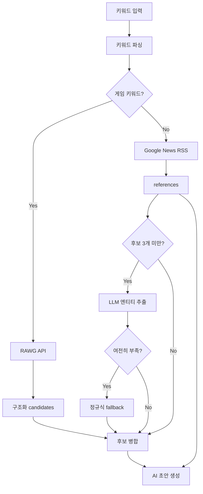

# 실제 정보 기반 AI 초안 생성 개선 (Real Data AI Draft)

## 개요
기존에는 Google News RSS 검색과 정규식 기반 후보명 추출에 의존해 실제 정보를 충분히 모으지 못하는 경우가 많았습니다. 이번 개선은 **시스템이 사실을 수집하고 AI는 글쓰기만 하는 구조**로 변경하여 신뢰도를 높였습니다.

---

## 핵심 구조

### 1. RAWG 게임 DB API 연동 (`lib/rawg.ts`)
게임 관련 키워드는 구조화된 글로벌 게임 DB인 RAWG API를 우선 활용합니다.
- 플랫폼 및 장르 필터 적용.
- Switch 2 키워드 감지 시 `2025-01-01 ~ 2026-12-31` 출시작 우선 조회.
- 평점 및 Metacritic 점수 메타데이터 수집.

### 2. 에이전트 엔티티 검증
외부 Codex 에이전트가 뉴스와 공식 자료를 교차 검증하여 후보군을 선별하고 가상의 제품명(Placeholder)이 원고에 포함되지 않도록 합니다. 웹앱은 이 과정에서 OpenAI API를 직접 호출하지 않습니다.

### 3. Research API 파이프라인
`GET /api/sources/research`를 통해 키워드를 분석하고, RAWG DB 조회 및 구글 뉴스를 크롤링하여 병합된 후보군(Candidates) 및 참조 데이터(References)를 생성합니다.

---

## 아키텍처 흐름

